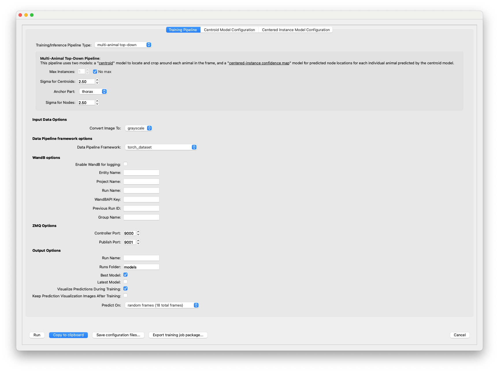
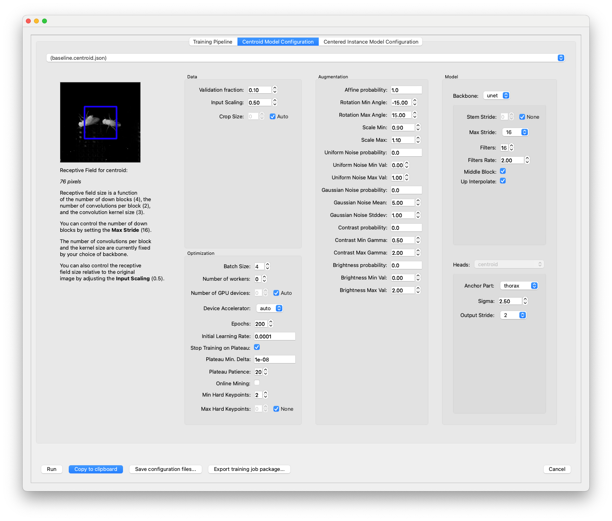

*Case: You've created a project with training data and you want to train models with custom hyperparameters.*

Hyperparameters include the model architecture, learning rate, and data augmentation settings. While model **parameters** are learned from your data during training, **hyperparameters** are not learned from your data—they have to be set before training since they control the training process.

This guide will explain how to create a custom training profile but doesn't cover how to decide what the hyperparameters should be. For more information about the hyperparameters, see our guide to [Configuring models](https://nn.sleap.ai/latest/reference/models/).

Training profiles are YAML files. The YAML format is fairly easy to read (and edit) with a text-editor and you can use the default "baseline" profiles as a starting point for creating your own training profiles. For example, take a look at the [baseline bottom-up profile](https://github.com/talmolab/sleap/blob/develop/sleap/training_profiles/baseline_medium_rf.bottomup.yaml) or our [other baseline profiles](https://github.com/talmolab/sleap/blob/develop/sleap/training_profiles).

But if this sounds intimidating, you don't have to edit the YAML file by hand! You can use the same GUI that's used for training on a local machine to export custom training profiles.

If it isn't open already, run SLEAP and open the SLEAP project with your training dataset. Then select the "**Run Training...**" command in the "**Predict**" menu. You'll see the training GUI which lets you configure the pipeline type and the hyperparameters for each model:



First pick the desired pipeline (i.e., top-down, bottom-up, or single animal). For each model in the pipeline, you'll then see a "**Model Configuration**" tab—in the image above with the top-down pipeline, there's one tab for configuring the centroid model and one for the centered instance model. Other pipelines will only have one model to configure.

You can click on each model configuration tab to configure the hyperparameters for training that model:



For advice about what you might want to customize with this dialog, see our guide to [Configuring models](https://nn.sleap.ai/latest/reference/models/).

Once you've configured each of your models, click the "**Save configuration files...**" button at the bottom of the dialog. You'll be prompted for where to save the files. It's a good idea to create a new folder which will contain the files since there will be multiple files exported.

Wherever you selected to save your files, you'll now have a custom training profile(s) with the settings you selected in the dialog. The filename of the training profile(s) will be:

- `bottomup.yaml` for a bottom-up pipeline,
- `centroid.yaml` and `centered_instance.yaml` for a top-down pipeline, and
- `single_instance.yaml` for a single animal pipeline.

(There will also be a `train-script.sh` file with the command-line command you could use to train your dataset using these training profiles, and possibly an `inference-script.sh` file if you selected frames for inference after training.)

If you're running training on a remote machine (including Colab), export your training job package into the remote machine. Then call:


```bash
sleap-nn train --config /path/to/profile.yaml "data_config.train_labels_path=[path/to/dataset.pkg.slp]"
```

for each model you want to train (where `path/to/custom/profile.yaml` should be replaced with the path to your custom training profile and `path/to/dataset.pkg.slp` replaced with the path to your training job package). See our guide to [remote training](running-sleap-remotely.md) for more details.

!!! note
    If you exported the training package as a ZIP file, it contains both the `.pkg.slp` and `.yaml` files necessary to train with the configuration you selected in the GUI. Before running the [`sleap-nn train`](https://nn.sleap.ai/latest/training/#using-cli) command, make sure to unzip this file:

    === "macOS/Linux"

        ```bash
        unzip training_job.zip -d training_job
        ```

    === "Windows (PowerShell)"

        ```powershell
        Expand-Archive -Path training_job.zip -DestinationPath training_job
        ```

    === "Windows (Command Prompt)"

        ```cmd
        tar -xf training_job.zip -C training_job
        ```

### Training Hardware support

SLEAP supports training on:

- **NVIDIA GPUs**: Fully supported and tested.
- **Apple Silicon Macs**: Supported and tested.

**Unsupported configurations:**

- AMD GPUs and older Macs (pre-M1) may fail during training.
- Other GPU architectures or unsupported hardware configurations may lead to memory or allocation errors.

GPU detection is automatic when you install SLEAP. Run `sleap doctor` to verify your GPU is detected. If you need to manually specify a backend, see the [Pre-release Versions](../installation.md#pre-release-versions) section.