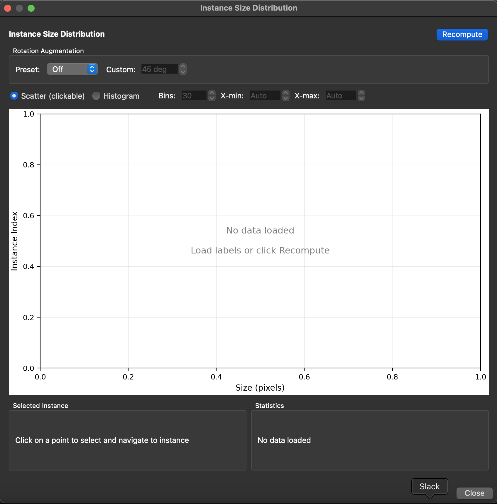
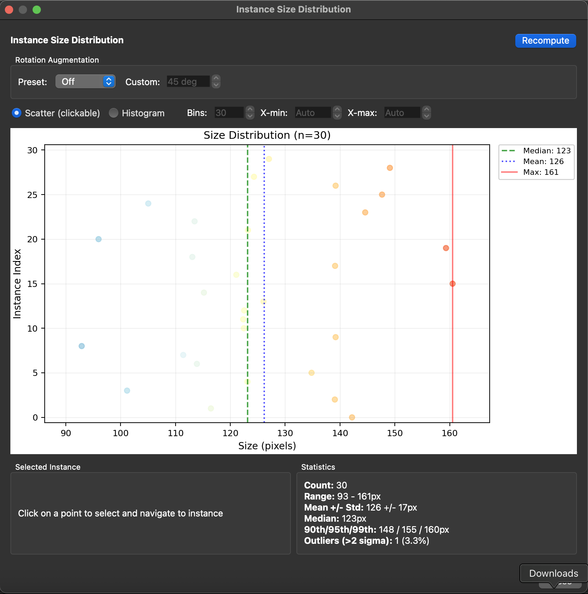

# Instance Size Distribution

*Case: You want to determine the optimal crop size for top-down models.*

When using top-down pose estimation pipelines, SLEAP crops around each detected instance before estimating pose. Choosing the right crop size is important:

- **Too small**: Parts of the animal may be cut off
- **Too large**: Wastes computation and may include other animals

The Instance Size Distribution widget helps you analyze your labeled data to choose an appropriate crop size.

## Accessing the Widget

From the GUI: **Analyze** → **Instance Size Distribution...**

This opens a dialog window showing the size distribution of all user-labeled instances in your project.





## Recompute

Click the **Recompute** button to recalculate sizes from your current labels. This is useful if you've added or modified labels since opening the dialog.

The widget only analyzes user-labeled instances (not predicted instances) to give you accurate statistics based on your ground truth annotations.

## Rotation Augmentation

The **Rotation Augmentation** controls let you preview how rotation augmentation during training will affect the required crop size.

When you rotate an instance, its bounding box grows to accommodate the rotated skeleton. This setting helps you understand what crop size you'll need if using rotation augmentation.

**Preset options:**

- **Off**: No rotation applied. Shows the raw bounding box sizes.
- **+/-15**: Simulates +/-15 degree rotation augmentation (common for videos with limited rotation).
- **+/-180**: Simulates full rotation augmentation (common for overhead/top-down views).
- **Custom**: Enables the custom angle spinner to set any angle from 0-180 degrees.

When using rotation augmentation in training, set this to match your training configuration to see the effective crop sizes you'll need.

## Visualization

The center plot shows the distribution of instance sizes. You can switch between two views:

### Scatter (clickable)

The default view shows each instance as a point:

- **X-axis**: Size in pixels (the larger dimension of the bounding box)
- **Y-axis**: Instance index (ordered by position in the labels file)
- **Point colors**: Colored by relative size (blue = near median, red = larger than median)
- **Vertical lines**: Show statistics:
  - **Green dashed**: Median size
  - **Blue dotted**: Mean size
  - **Red solid**: Maximum size

**Clicking a point** selects that instance and navigates to it in the main video player, making it easy to inspect outliers.

### Histogram

An alternative view showing the count distribution:

- **X-axis**: Size in pixels
- **Y-axis**: Count (number of instances in each bin)
- **Vertical lines**: Same statistics as scatter view (median, mean, max)

**Histogram options** (enabled when Histogram is selected):

- **Bins**: Number of histogram bins (5-100, default 30)
- **X-min**: Minimum x-axis value, or "Auto" for automatic range
- **X-max**: Maximum x-axis value, or "Auto" for automatic range

Use the range controls to zoom in on a specific size range if needed.

## Selected Instance

When you click a point in the scatter plot, the **Selected Instance** panel shows:

- **Frame**: The frame index where the instance appears
- **Instance**: The instance index within that frame
- **Video**: The video index (for multi-video projects)
- **Raw Size**: The bounding box size without rotation (with width × height dimensions)
- **Rotated Size**: The effective size with the current rotation setting applied

This helps you understand both the original annotation size and how it will grow with rotation augmentation.

## Statistics

The **Statistics** panel shows summary statistics for all instances:

- **Count**: Total number of user-labeled instances
- **Range**: Minimum and maximum sizes in pixels
- **Mean +/- Std**: Average size with standard deviation
- **Median**: The middle value (50th percentile)
- **90th/95th/99th**: Percentile values for choosing crop sizes
- **Outliers (>2 sigma)**: Count of instances more than 2 standard deviations above the mean

These statistics update when you change the rotation setting.

## Choosing a Crop Size

Use the statistics to choose an appropriate crop size:

1. **95th percentile** is a common choice—it covers 95% of instances while excluding extreme outliers
2. **Add 10-20% padding** for animals near frame edges or to account for prediction uncertainty
3. **Consider rotation**: If using rotation augmentation, set the rotation preview to match and use those statistics

For example, if your 95th percentile with +/-180 rotation is 200px, a crop size of 220-240px would be reasonable.

## Tips

- **Consistent animal sizes**: If your animals are similar sizes, the distribution will be tight and crop size selection is straightforward
- **Variable sizes**: If sizes vary significantly (e.g., adults and juveniles), consider using a larger crop size or filtering your training data
- **Multiple videos**: The widget analyzes all videos together. If recording conditions vary, click through outliers to see if they come from specific videos
- **Inspect outliers**: Click on the largest points in the scatter plot to check if they represent real variation or labeling errors

## Using with Crop Size Visualization

After choosing a crop size, you can visualize it in the main view:

1. Open the training dialog (**Predict** → **Run Training...**)
2. The crop size overlay will show the crop region on your video
3. Scrub through frames to verify the crop captures the full animal

## Programmatic Access

For scripting or automation, you can compute instance sizes programmatically:

```python
import sleap_io as sio
from sleap.gui.learning.size import compute_instance_sizes
import numpy as np

# Load labels
labels = sio.load_file("labels.slp")

# Compute sizes for user-labeled instances
sizes = compute_instance_sizes(labels, user_instances_only=True)

# Get raw sizes
raw_sizes = np.array([s.raw_size for s in sizes])
print(f"95th percentile: {np.percentile(raw_sizes, 95):.0f}px")

# With rotation augmentation (+/-180 degrees)
rotated_sizes = np.array([s.get_rotated_size(180) for s in sizes])
print(f"95th percentile with rotation: {np.percentile(rotated_sizes, 95):.0f}px")
```

Each `InstanceSizeInfo` object contains:
- `video_idx`, `frame_idx`, `instance_idx`: Location identifiers
- `raw_width`, `raw_height`: Bounding box dimensions
- `raw_size`: Maximum of width and height
- `get_rotated_size(angle)`: Size needed with rotation augmentation

## Related

- [Configuring Models](https://nn.sleap.ai/latest/reference/models/) - Full details on crop size and other model parameters
- [Creating a Custom Training Profile](creating-a-custom-training-profile.md) - How to save your crop size settings
