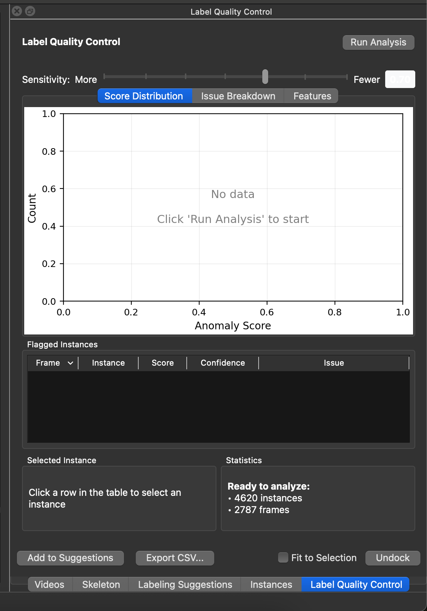
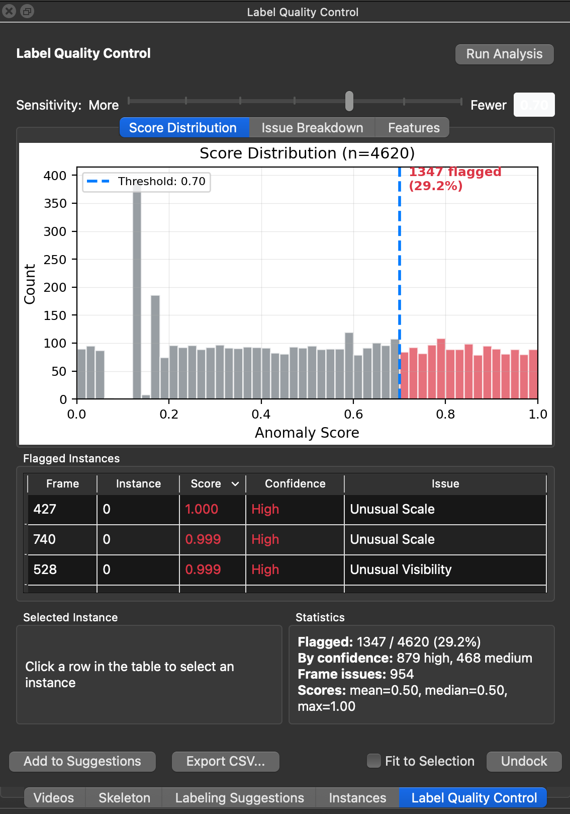

# Label Quality Control

*Case: You want to check your labels for errors before training or after proofreading.*

SLEAP 1.6 introduces a Label Quality Control (QC) module that automatically detects common labeling errors using Gaussian Mixture Model (GMM) based anomaly detection.

## Accessing Label QC

From the GUI: **Analyze** → **Label QC...**

This opens a dockable panel that can be tabbed with other panels (Videos, Skeleton, etc.) or undocked as a floating window.





## Running Analysis

Click the **Run Analysis** button to analyze all labeled instances in your project. The analysis:

1. Extracts features from each instance (edge lengths, joint angles, node spacing, etc.)
2. Fits a statistical model to learn what "normal" poses look like
3. Scores each instance based on how much it deviates from the norm
4. Displays results in the visualization tabs and table

A progress bar shows the analysis status. You can click **Cancel** to stop a running analysis.

## Sensitivity Slider

The **Sensitivity** slider controls the threshold for flagging instances:

- **More** (left): Lower threshold flags more instances (higher sensitivity)
- **Fewer** (right): Higher threshold flags fewer instances (lower sensitivity)
- The current threshold value is displayed on the right (e.g., "0.70")

You can also click directly on the Score Distribution histogram to set the threshold visually.

## Visualization Tabs

Three tabs provide different views of the analysis results:

### Score Distribution

A histogram showing the distribution of anomaly scores across all instances:

- **X-axis**: Anomaly Score (0.0 to 1.0)
- **Y-axis**: Count (number of instances)
- **Gray bars**: Instances below the threshold (considered "normal")
- **Red bars**: Instances at or above the threshold (flagged as potential errors)
- **Blue dashed line**: Current threshold position
- **Red annotation**: Count and percentage of flagged instances

A typical distribution shows most instances clustered at low scores (normal), with a tail extending toward higher scores (potential errors).

### Issue Breakdown

A horizontal bar chart showing the count of each issue type among flagged instances. Common issue categories include:

- **Unusual Visibility**: Unusual pattern of visible/invisible nodes
- **Unusual Edge Length**: A skeleton edge is much longer or shorter than typical
- **Unusual Node Spacing**: Nodes are unusually close together or far apart
- **Unusual Scale**: Instance is much larger or smaller than typical
- **Unusual Joint Angle**: A joint is bent at an unusual angle
- **High Hull Area**: The convex hull of the skeleton is unusually large
- **Likely L/R Swap**: Left and right limbs may be swapped

This view helps identify systematic labeling issues in your dataset.

### Features

Box plots comparing feature distributions between normal (gray) and flagged (red) instances. This tab shows the top discriminating features—the characteristics that most differentiate flagged instances from normal ones.

Features shown may include:

- **max angle / mean angle**: Joint angle statistics
- **hull compact**: Compactness of the skeleton's convex hull
- **max pairwise**: Maximum distance between any two nodes
- **hull area / bbox area**: Size metrics for the skeleton

This view helps you understand *why* instances are being flagged.

## Flagged Instances Table

A sortable table listing all instances that exceed the current threshold:

| Column | Description |
|--------|-------------|
| **Frame** | Frame index where the instance appears |
| **Instance** | Instance index within that frame |
| **Score** | Anomaly score (0.0–1.0). Higher scores indicate more unusual instances. Displayed in red for scores ≥0.8, yellow for ≥0.6 |
| **Confidence** | "High" (score ≥0.8), "Medium" (0.5–0.8), or "Low" (<0.5) |
| **Issue** | The primary issue type (most contributing feature) |

**Interacting with the table:**

- **Click** a row to navigate to that frame and select the instance
- **Double-click** for the same navigation behavior
- **Click column headers** to sort by that column
- The table is sorted by Score (descending) by default

## Selected Instance

When you select a row in the table, the **Selected Instance** panel shows detailed information:

- **Frame / Instance**: Location identifiers
- **Score**: The anomaly score with confidence level
- **Primary Issue**: The most likely type of error
- **Top Features**: The 3 features contributing most to the high score, with their values

This helps you understand why a specific instance was flagged before reviewing it in the video.

## Statistics

The **Statistics** panel shows a summary of the analysis:

- **Flagged**: Count of flagged instances / total instances (percentage)
- **By confidence**: Breakdown of flagged instances by confidence level (high, medium)
- **Frame issues**: Number of frames with frame-level issues (possible duplicates or missing instances)
- **Scores**: Statistical summary (mean, median, max) of all anomaly scores

## Add to Suggestions

Click **Add to Suggestions** to add all flagged frames to the Labeling Suggestions list. This creates a review queue so you can systematically work through potential errors.

Frames already in the suggestions list are skipped to avoid duplicates.

## Additional Controls

- **Export CSV...**: Export all results (scores, features, issues) to a CSV file for external analysis
- **Fit to Selection**: When checked, the video player automatically zooms to fit the selected instance
- **Undock / Dock**: Toggle between docked (tabbed) and floating window modes

## Programmatic Access

The QC module is available programmatically via `sleap.qc`:

```python
import sleap_io as sio
from sleap.qc import LabelQCDetector, QCConfig

# Load labels
labels = sio.load_file("labels.slp")

# Create detector with default config
detector = LabelQCDetector()

# Fit on labels (learns what "normal" looks like from your data)
detector.fit(labels)

# Score all instances
results = detector.score(labels)

# Get flagged instances above threshold (0.0-1.0, higher = more anomalous)
flagged = results.get_flagged(threshold=0.7)

# Inspect flagged instances
for flag in flagged:
    print(f"Video {flag.video_idx}, Frame {flag.frame_idx}, Instance {flag.instance_idx}")
    print(f"  Score: {flag.score:.2f}")
    print(f"  Issue: {flag.top_issue}")
```

### Configuration Options

```python
from sleap.qc import QCConfig

config = QCConfig(
    instance_threshold=0.7,      # Score threshold for flagging
    gmm_n_components=3,          # Number of GMM components
    duplicate_iou_threshold=0.5, # IoU threshold for duplicate detection
)
detector = LabelQCDetector(config=config)
```

### Available Classes

- `LabelQCDetector`: Main detection interface
- `QCConfig`: Configuration settings
- `QCResults`: Container for scores, frame results, and feature contributions
- `QCFlag`: Individual flagged instance with score and contributing features

## Tips

- Run QC after initial labeling but before training to catch errors early
- Re-run after proofreading tracking results to verify corrections
- Not all flagged items are actual errors—use your judgment when reviewing
- Lower the threshold if you want to be more thorough; raise it to focus on the most obvious issues
- Use the Issue Breakdown tab to identify systematic problems in your labeling workflow
- QC is most effective when you have consistent labeling practices across your dataset
