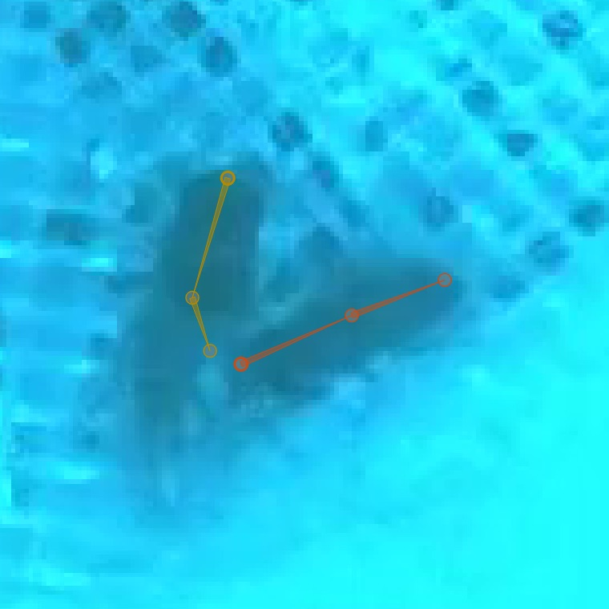

# Tracking and Proofreading

This guide covers tracking methods and proofreading strategies for multi-animal pose estimation. For a step-by-step introduction, see the [Tracking Tutorial](../tutorial/tracking-new-data.md) and [Proofreading Tutorial](../tutorial/proofreading.md).

---

## How Tracking Works

Tracking connects frame-by-frame pose predictions into continuous **tracks** (identities across frames). The tracker:

1. Takes predictions from frame N
2. Compares them to **candidates** from previous frames
3. Assigns each instance to an existing track or creates a new one

Prediction and tracking are distinct processes—you can run tracking separately after inference to try different methods and parameters.

[:octicons-arrow-right-24: sleap-nn Tracking Reference](https://nn.sleap.ai/latest/guides/tracking/)

---

## Tracking Methods

### Candidates Method

How the tracker builds the pool of candidates to match against. This determines which previous instances are considered when assigning track IDs to new detections.

#### Fixed Window (Default)

Pools all instances from the last N frames together as matching candidates.

```
Frame:    t-3    t-2    t-1    t (current)
          ┌──────────────────┐
Instances │ A B   A B   A B  │  ? ?  ← match against pooled candidates
          └──────────────────┘
              window_size=3
```

All instances from frames within the window are collected into a single candidate pool. When matching instances in the current frame, each is compared against this entire pool, and the best matches are assigned.

```bash
sleap-nn track -i video.mp4 -m models/ -t --candidates_method fixed_window --tracking_window_size 10
```

**Pros:**

- Simple and fast
- Works well when all instances are consistently detected

**Cons:**

- If a track is lost for several frames, its history gets pushed out of the window
- All tracks share the same temporal context

**Best for**: Most scenarios with reliable detections—good balance of speed and accuracy.

[:octicons-arrow-right-24: Fixed Window Details](https://nn.sleap.ai/latest/guides/tracking/#fixed-window-default)

#### Local Queues

Maintains a separate history queue for each track ID. Each track remembers its own last N instances independently.

```
Track A:  [A@t-5, A@t-4, A@t-3, A@t-2, A@t-1]  ← own history
Track B:  [B@t-3, B@t-2, B@t-1]                 ← own history (was occluded at t-5, t-4)

Frame t:  ? ?  ← each detection matched against per-track histories
```

When an instance disappears temporarily (e.g., due to occlusion), its track queue preserves its history. When the instance reappears, it can still be matched to its original track even if many frames have passed.

```bash
sleap-nn track -i video.mp4 -m models/ -t --candidates_method local_queues --tracking_window_size 5
```

**Pros:**

- **Supports max tracking**: Since each track has its own queue, the system naturally maintains a fixed number of identities and prioritizes matching to existing tracks before spawning new ones
- Robust to temporary track breaks and occlusions
- Each track maintains its own temporal context
- Better identity preservation when instances disappear and reappear

**Cons:**

- Slightly more memory overhead
- Can be slower with many tracks

**Best for**: Experiments with a known, fixed number of animals—especially when you want to maintain consistent identities throughout the video. Also good for scenes with occlusions or when animals frequently leave and re-enter the frame.

[:octicons-arrow-right-24: Local Queues Details](https://nn.sleap.ai/latest/guides/tracking/#local-queues)

#### Optical Flow

Uses optical flow ([Xiao et al., 2018](https://arxiv.org/abs/1804.06208)) to predict where instances will move, then uses these shifted positions as candidates.

```bash
sleap-nn track -i video.mp4 -m models/ -t --use_flow
```

**Best for**: Fast-moving animals where position changes significantly between frames.

[:octicons-arrow-right-24: Optical Flow Details](https://nn.sleap.ai/latest/guides/tracking/#optical-flow)

---

### Scoring Methods

How similarity is measured between instances and candidates.

| Method | Description | Use Case |
|--------|-------------|----------|
| `oks` | Object Keypoint Similarity—distance between keypoints, normalized | Default, works well for most cases |
| `euclidean_dist` | Euclidean distance between features | Simple and fast |
| `cosine_sim` | Cosine similarity between feature vectors | Good for image-based features |
| `iou` | Intersection over Union of bounding boxes | When instances have distinct spatial positions |

Set with `--scoring_method`:

```bash
sleap-nn track -i video.mp4 -m models/ -t --scoring_method oks
```

---

### Feature Types

What features are used for matching.

| Feature | Description |
|---------|-------------|
| `keypoints` | All predicted keypoint positions (default) |
| `centroids` | Instance centroid only |
| `bboxes` | Bounding box coordinates |
| `image` | Image features from the model |

Set with `--features`:

```bash
sleap-nn track -i video.mp4 -m models/ -t --features centroids --scoring_method euclidean_dist
```

---

### Matching Methods

How instances are paired with candidates once similarity is computed.

| Method | Description |
|--------|-------------|
| `hungarian` | Finds optimal global assignment minimizing total cost (default) |
| `greedy` | Picks best match for each instance in order |

Set with `--track_matching_method`:

```bash
sleap-nn track -i video.mp4 -m models/ -t --track_matching_method hungarian
```

---

## Track Settings

### Maximum Tracks

Limit the number of track identities. Once reached, no new tracks are created.

```bash
sleap-nn track -i video.mp4 -m models/ -t --max_tracks 5
```

In the GUI, set via **Predict > Run Inference**:


### Connect Single Track Breaks

When exactly one track is lost in frame N and exactly one new track appears in frame N+1, automatically connect them. Enable with the `Connect Single Track Breaks` checkbox in the GUI.

### Track Window Size

How many previous frames to consider when building candidates. Larger windows are more robust but slower.

```bash
sleap-nn track -i video.mp4 -m models/ -t --tracking_window_size 10
```

---

## Track-Only Mode

Re-run tracking on existing predictions without re-running inference:

```bash
sleap-nn track -i predictions.slp --tracking
```

This is useful for trying different tracking parameters without recomputing poses.

[:octicons-arrow-right-24: Track-Only Mode](https://nn.sleap.ai/latest/guides/tracking/#track-only-mode)

---

## Example Configurations

### Fast-Moving Animals

```bash
sleap-nn track -i video.mp4 -m models/ -t --use_flow --of_img_scale 0.5
```

### Crowded Scenes

```bash
sleap-nn track -i video.mp4 -m models/ -t --candidates_method local_queues --tracking_window_size 10 --max_tracks 10
```

### High Accuracy

```bash
sleap-nn track -i video.mp4 -m models/ -t --scoring_method oks --scoring_reduction mean --track_matching_method hungarian
```

[:octicons-arrow-right-24: More Examples](https://nn.sleap.ai/latest/guides/tracking/#example-configurations)

---

## Improving Tracking Results

If tracking results are poor:

1. **Try different methods**: Change candidates method, scoring method, or enable optical flow
2. **Adjust track window**: Increase `--tracking_window_size` for more context
3. **Limit tracks**: Set `--max_tracks` if you know the number of animals
4. **Improve predictions**: Poor frame-by-frame predictions lead to poor tracking—consider [adding more training data](importing-predictions-for-labeling.md)

[:octicons-arrow-right-24: Troubleshooting](https://nn.sleap.ai/latest/guides/tracking/#troubleshooting)

---

## Proofreading

Once tracking is complete, you'll need to review and fix errors. There are two main types of mistakes:

### Setting Up for Proofreading

1. Enable **Color Predicted Instances** in the View menu
2. Choose a good **color palette**:
   - "five+" palette for small numbers of instances (makes later tracks stand out)
   - "alphabet" palette for many instances (26 distinct colors)
3. Set **Trail Length** > 0 to see where instances were in prior frames

Colors appear both on the video frame:


And on the seekbar:


You can edit palettes in the [View menu](../learnings/gui.md/#view).

---

### Fixing Lost Identities

When the tracker fails to connect an instance to any previous track, creating a spurious new identity.

**Strategy:**

1. Use **Go > Next Track Spawn Frame** to jump to frames where new tracks appear
2. Select the instance with the new track identity
3. Look at the track trail to determine which existing track it should belong to
4. Hold the **Show tracks legend** key (see [Keyboard Navigation](../learnings/gui.md/#keyboard-navigation)) to see numbered tracks:


5. While holding the key, type the number to assign the instance to that track (e.g., **Command + 1** assigns to track "F")

---

### Fixing Identity Swaps

When the tracker assigns instances to the wrong tracks (swapping identities between animals).

**Strategy 1: Visual Inspection with Trails**

1. Set trail length to ~50 frames
2. Use **frame next large step** to jump through predictions
3. Look for crossed or tangled trails indicating swaps:


4. When you find a swap, step through frames to find the exact frame
5. Use **Labels > Transpose Instance Tracks** or the tracks legend to fix

**Strategy 2: Velocity-Based Suggestions**

1. Open **Labeling Suggestions** panel
2. Select **velocity** method
3. Choose a stable node (body center, not appendages)
4. Adjust threshold—higher means fewer suggestions


5. Step through suggestions with **Go > Next Suggestion**
6. Fix swaps as they're found

**Propagating Fixes:**

Enable **Propagate Track Labels** to apply track changes to all subsequent frames automatically.

---

### Orientation Visibility

If instance orientation is hard to see, change edge style from lines to **wedges** in **View > Edge Style**:



Wedges point from source to destination nodes in your skeleton.
