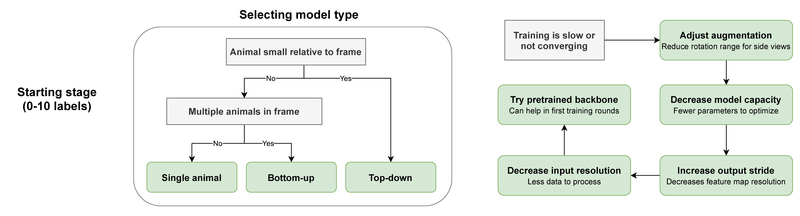
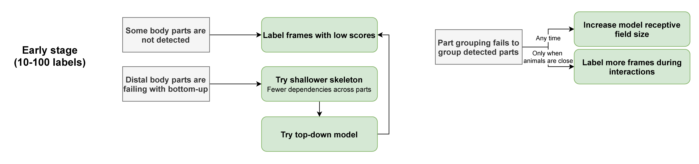
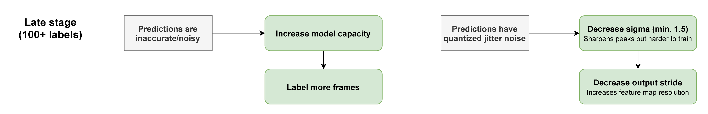

# Help

Stuck? Can't get SLEAP to run? Crashing? Try the tips below.

**First step:** Run `sleap doctor` to check your installation.

---

## Installation

<details class="plain" open markdown>
<summary>I can't get SLEAP to install!</summary>

Have you tried all of the steps in the [installation instructions](installation.md)?

If so, please [start a discussion](https://github.com/talmolab/sleap/discussions) or [open an issue](https://github.com/talmolab/sleap/issues) and tell us:

- How you're trying to install it
- What error messages you're getting
- Which operating system you're on
- Output of `sleap doctor` (if available)

</details>

<details class="plain" open markdown>
<summary>Can I install it on a computer without a GPU?</summary>

Yes! Install SLEAP normally using `uv` and the GPU support will be ignored. Use `--torch-backend cpu` to explicitly install CPU-only:

```bash
uv tool install --python 3.13 "sleap[nn]" --prerelease allow --torch-backend cpu
```

</details>

<details class="plain" open markdown>
<summary>What if I already have CUDA set up on my system?</summary>

SLEAP 1.5+ uses PyTorch, which bundles its own CUDA libraries. Your system CUDA installation is not used. The `--torch-backend auto` flag will detect your GPU and install the appropriate PyTorch version.

</details>


## Display / GUI Issues

<details class="plain" open markdown>
<summary>SLEAP crashes on Linux with <code>ImportError: undefined symbol: _ZN14QObjectPrivateC2Ei, version Qt_6_PRIVATE_API</code></summary>

This error occurs when the system has Qt 6 libraries (e.g., Debian 12 ships Qt 6.4) that conflict with the Qt libraries bundled inside PySide6. The dynamic linker loads the system's older `libQt6DBus.so.6` or `libQt6Core.so.6` instead of PySide6's bundled version, causing a symbol version mismatch.

Common error messages:

```
ImportError: /usr/lib/x86_64-linux-gnu/libQt6DBus.so.6: undefined symbol: _ZN14QObjectPrivateC2Ei, version Qt_6_PRIVATE_API
```

**This is fixed automatically in SLEAP v1.6.1+.** On Linux, SLEAP now ensures PySide6's bundled Qt libraries and plugins are loaded before any system or conda-provided Qt libraries.

If you're on an older version, you can work around it by prepending PySide6's Qt library path when launching SLEAP:

```bash
PYSIDE_QT=$("$(uv tool dir)/sleap/bin/python" -c "import os,PySide6;print(os.path.join(os.path.dirname(PySide6.__file__),'Qt'))") && \
  LD_LIBRARY_PATH="$PYSIDE_QT/lib${LD_LIBRARY_PATH:+:$LD_LIBRARY_PATH}" \
  QT_PLUGIN_PATH="$PYSIDE_QT/plugins" \
  sleap
```

If you suspect the automatic fix is causing issues on your system (e.g., a native Linux desktop that was working before), you can disable it:

```bash
export SLEAP_SKIP_QT_FIX=1
sleap
```

</details>

<details class="plain" open markdown>
<summary>SLEAP crashes with <code>Could not load the Qt platform plugin "xcb"</code></summary>

This typically has two causes:

**1. Missing `libxcb-cursor0`** (required since Qt 6.5):

```bash
sudo apt install libxcb-cursor0  # Debian/Ubuntu
```

**2. OpenCV's Qt plugins conflicting with PySide6's.** The error may mention a path like `.../cv2/qt/plugins`. This happens because `opencv-python` bundles its own Qt and its plugin path takes priority over PySide6's.

SLEAP v1.6.1+ handles this automatically by setting `QT_PLUGIN_PATH` to PySide6's plugins on Linux. If you're on an older version, use the workaround in the entry above.

</details>

<details class="plain" open markdown>
<summary>SLEAP GUI doesn't work over SSH / X11 forwarding</summary>

When connecting to a remote Linux machine via SSH with X forwarding (`ssh -X` or `ssh -Y`), make sure:

1. **X forwarding is enabled** on both client and server (`X11Forwarding yes` in `/etc/ssh/sshd_config`)
2. **`DISPLAY` is set** — run `echo $DISPLAY` (should show something like `localhost:10.0`)
3. **`libxcb-cursor0` is installed** on the remote machine (`sudo apt install libxcb-cursor0`)
4. **Conda base is deactivated** if active — conda can inject conflicting Qt libraries:
   ```bash
   conda deactivate
   conda config --set auto_activate_base false  # prevent future interference
   ```

If you still see Qt library errors, see the entries above. Running `sleap doctor` will report your environment details for further debugging.

</details>

<details class="plain" open markdown>
<summary>Videos fail to load with <code>Could not open codec h264</code> or <code>Failed initializing scaling graph</code></summary>

This can happen on Linux when OpenCV's video decoder picks up incompatible ffmpeg libraries. Common error messages:

```
[ERROR:0@70.376] global cap_ffmpeg_impl.hpp:1448 open Could not open codec h264, error: -11
[ERROR:0@70.376] global cap_ffmpeg_impl.hpp:1456 open VIDEOIO/FFMPEG: Failed to initialize VideoCapture
```

Often preceded by many lines of:

```
[swscaler @ ...] Failed initializing scaling graph (Resource temporarily unavailable):
  fmt:yuv420p csp:unknown prim:unknown trc:unknown -> fmt:bgr24 ...
```

And ultimately:

```
IndexError: Failed to read frame index 0.
```

**Fix:** Switch the video backend from OpenCV to imageio-ffmpeg:

```bash
sleap --video-backend ffmpeg
```

This persists to your preferences — all future launches will use the FFMPEG backend automatically. You can also use `pyav` as an alternative. To switch back:

```bash
sleap --video-backend opencv
```

</details>


## Usage

<details class="plain" open markdown>
<summary>How do I use SLEAP?</summary>

If you're new to pose tracking in general, check out [this talk](https://cbmm.mit.edu/video/decoding-animal-behavior-through-pose-tracking) or our review in _[Nature Neuroscience](https://rdcu.be/caH3H)_.

If you're just new to SLEAP, start with the [high-level overview](overview.md) and then follow the [tutorial](tutorial/overview.md).

Once you get the hang of it, check out the [guides](guides/guides-overview.md) for more detailed info.

</details>

<details class="plain" open markdown>
<summary>Does my data need to be in a particular format?</summary>

SLEAP supports many formats, including all common video formats and imported data from DeepLabCut and others.

However, some video acquisition software saves videos in formats not suitable for computer vision processing. A common issue is that videos are not **reliably seekable**—you may not get the same data when reading a particular frame index. This is because many video formats reconstruct images using data from adjacent frames.

If you think you may be affected, re-encode your videos:

```bash
ffmpeg -y -i "input.mp4" -c:v libx264 -pix_fmt yuv420p -preset superfast -crf 23 "output.mp4"
```

**Options explained:**

- `-c:v libx264`: H264 compression
- `-pix_fmt yuv420p`: Compatibility with all players
- `-preset superfast`: Enables reliable seeking
- `-crf 23`: Quality level (15 = nearly lossless, 30 = highly compressed)

If you don't have `ffmpeg`, install it from [ffmpeg.org](https://ffmpeg.org/download.html) or via your package manager.

</details>

<details class="plain" open markdown>
<summary>I get strange results where poses appear correct but shifted relative to the image</summary>

This is most likely a video compression issue. Re-encode your video using the ffmpeg command above.

</details>

<details class="plain" open markdown>
<summary>How do I get predictions out?</summary>

See [Exporting the Results](tutorial/exporting-the-results.md) and [CLI Reference](reference/command-line-interfaces.md).

</details>

<details class="plain" open markdown>
<summary>What do I do with the output of SLEAP?</summary>

Check out the [Analysis examples](notebooks/Analysis_examples.ipynb) notebook for working with pose data in Python.

</details>


## Troubleshooting Workflows

SLEAP can work with any type of data, but sometimes tweaking configurations or parameters helps improve performance.

### Stage 1: Getting Started

When starting off, troubleshoot the model type and basic configurations if you can't get results after initial training:



See [Configuring Models](https://nn.sleap.ai/latest/reference/models/) for more information on model types.

### Stage 2: Refining Models

Once you have enough labeled frames and a working model, refine by selecting frames that represent problem areas (overlapping animals, unusual poses):



### Stage 3: Fine-Tuning

In later stages, squeeze out additional performance by tuning hyperparameters:



---

## Getting More Help

<details class="plain" open markdown>
<summary>I've found a bug or have another problem!</summary>

1. Run `sleap doctor` and copy the output
2. [Start a discussion](https://github.com/talmolab/sleap/discussions) to get help from developers and community
3. Or [open an issue](https://github.com/talmolab/sleap/issues) if you've found a bug

</details>

<details class="plain" open markdown>
<summary>Can I just talk to someone?</summary>

SLEAP is a complex machine learning system, and we may not have considered your specific use case.

Feel free to reach out at `talmo@salk.edu` if you have a question that isn't covered here.

</details>


## Improving SLEAP

**How can you help?**

- **Tell your friends!** We love hearing stories about what worked or didn't work (`talmo@salk.edu`)
- **[Cite our paper](https://www.nature.com/articles/s41592-022-01426-1)** in your publications
- **Share ideas** for new features in the [Discussion forum](https://github.com/talmolab/sleap/discussions/categories/ideas)
- **Contribute code!** See our [contribution guidelines](contribute.md)

??? note "BibTeX"

    ```bibtex
    @ARTICLE{Pereira2022sleap,
       title={SLEAP: A deep learning system for multi-animal pose tracking},
       author={Pereira, Talmo D and Tabris, Nathaniel and Matsliah, Arie and
          Turner, David M and Li, Junyu and Ravindranath, Shruthi and
          Papadoyannis, Eleni S and Normand, Edna and Deutsch, David S and
          Wang, Z. Yan and McKenzie-Smith, Grace C and Mitelut, Catalin C and
          Castro, Marielisa Diez and D'Uva, John and Kislin, Mikhail and
          Sanes, Dan H and Kocher, Sarah D and Samuel S-H and
          Falkner, Annegret L and Shaevitz, Joshua W and Murthy, Mala},
       journal={Nature Methods},
       volume={19},
       number={4},
       year={2022},
       publisher={Nature Publishing Group}
    }
    ```

---

## Usage Data

To help us improve SLEAP, you may allow us to collect basic and **anonymous** usage data. If enabled from the **Help** menu, the SLEAP GUI will transmit information such as which version of Python and operating system you are running.

This helps us:

- Understand which systems SLEAP is used on
- Ensure updates don't break compatibility
- Report usage to grant funding agencies

You can opt out at any time from the menu. To prevent data sharing entirely, launch with `sleap-label --no-usage-data`. Usage data is only shared from the GUI, not the API or CLIs. See the [source code](https://github.com/talmolab/sleap/blob/develop/sleap/gui/web.py) for exactly what is collected.
