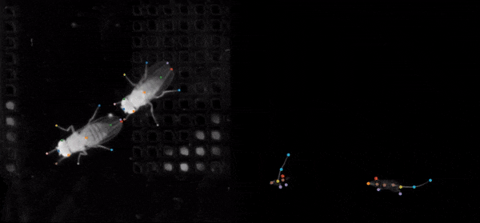

# Social LEAP Estimates Animal Poses (SLEAP)

<div class="hero" markdown>

</div>

<div class="badges" markdown>
[](https://github.com/talmolab/sleap)
[](https://github.com/talmolab/sleap/releases/)

[](https://pypi.org/project/sleap)
[](https://www.nature.com/articles/s41592-022-01426-1)
</div>

**SLEAP** is an open-source deep learning framework for multi-animal pose tracking ([Pereira et al., Nature Methods, 2022](https://www.nature.com/articles/s41592-022-01426-1)). It provides an end-to-end workflow from labeling to trained models, with a purpose-built GUI for active learning and proofreading.

## ✨ Features

- **Easy installation** – One-line install with support for all major OSes
- **Powerful GUI** – Human-in-the-loop workflow for rapidly labeling large datasets
- **Flexible models** – Single and multi-animal pose estimation with top-down and bottom-up strategies
- **Customizable architectures** – Neural networks that deliver accurate predictions with very few labels
- **Fast training** – 15-60 mins on a single GPU for typical datasets
- **Fast inference** – Up to 600+ FPS batch processing, <10ms realtime latency
- **Modern backends** – [`sleap-io`](https://io.sleap.ai) for data handling and PyTorch-based [`sleap-nn`](https://nn.sleap.ai) for training

**Let's Get Some SLEAP!** 🐭🐭

---

## 📚 Explore the Docs

<div class="grid cards" markdown>

-   :material-map:{ .lg .middle } **Workflow Overview**

    ---

    End-to-end workflow with links to all resources.

    [:octicons-arrow-right-24: View Workflow](overview.md)

-   :material-school:{ .lg .middle } **Tutorial**

    ---

    Step-by-step guide from labeling to tracking.

    [:octicons-arrow-right-24: Start Learning](tutorial/overview.md)

-   :material-book-open-variant:{ .lg .middle } **Guides**

    ---

    Advanced workflows and best practices.

    [:octicons-arrow-right-24: Explore Guides](guides/guides-overview.md)

-   :material-notebook:{ .lg .middle } **Notebooks**

    ---

    Jupyter notebooks for training, analysis, and more.

    [:octicons-arrow-right-24: Browse Notebooks](notebooks/notebooks-overview.md)

-   :material-lightbulb-on:{ .lg .middle } **Learning**

    ---

    GUI, training options, skeleton design, and more.

    [:octicons-arrow-right-24: Deep Dive](learnings/system-overview.md)

-   :material-bookshelf:{ .lg .middle } **Reference**

    ---

    CLI, datasets, and full API.

    [:octicons-arrow-right-24: Reference Docs](api/index.md)

</div>

---

## 🚀 Get some SLEAP!

### Quick start

Install [`uv`](https://github.com/astral-sh/uv) first:

```bash
# macOS/Linux
curl -LsSf https://astral.sh/uv/install.sh | sh

# Windows
powershell -c "irm https://astral.sh/uv/install.ps1 | iex"
```

Then install SLEAP:

```bash
uv tool install --python 3.13 "sleap[nn]" --torch-backend auto
```

Launch the GUI:

```bash
sleap label
```

[:octicons-arrow-right-24: Full installation instructions](installation.md)

### Learn to SLEAP

- **Learn step-by-step:** [Tutorial](tutorial/overview.md)
- **Learn more advanced usage:** [Guides](guides/guides-overview.md) and [Notebooks](notebooks/notebooks-overview.md)
- **Learn by watching:** [ABL:AOC 2023 Workshop](https://www.youtube.com/watch?v=BfW-HgeDfMI) and [MIT CBMM Tutorial](https://cbmm.mit.edu/video/decoding-animal-behavior-through-pose-tracking)
- **Learn by reading:** [Paper (Pereira et al., Nature Methods, 2022)](https://www.nature.com/articles/s41592-022-01426-1) and [Review on behavioral quantification (Pereira et al., Nature Neuroscience, 2020)](https://rdcu.be/caH3H)
- **Learn from others:** [Discussions on Github](https://github.com/talmolab/sleap/discussions)

---

## 🔄 Coming from SLEAP 1.4 or earlier?

!!! tip "New in SLEAP v1.5+"
    SLEAP v1.5+ introduced major changes including UV-based installation, PyTorch backend via `sleap-nn`, and modular data workflows with `sleap-io`. Check out [Migration Guide](guides/migrating-to-sleap-1-5.md)!

| SLEAP ≤ 1.4 | SLEAP 1.5+ |
|-------------|------------|
| Conda installation | UV or pip installation |
| TensorFlow backend | PyTorch backend (`sleap-nn`) |
| Monolithic package | Modular: GUI + `sleap-nn` + `sleap-io` |

!!! warning "Legacy Documentation"
    If you are using SLEAP version 1.4.1 or earlier, please visit the [legacy documentation](https://legacy.sleap.ai).

---

## Get Help

<div class="grid cards" markdown>

-   :material-help-circle:{ .lg } **Help Page**

    Common issues and solutions. [View Help](help.md)

-   :fontawesome-brands-github:{ .lg } **Report Issues**

    Found a bug? [Create an issue](https://github.com/talmolab/sleap/issues/new?template=bug_report.md)

-   :material-forum:{ .lg } **Discussions**

    Questions? [Start a discussion](https://github.com/talmolab/sleap/discussions)

</div>

---

## References

SLEAP is the successor to the single-animal pose estimation software [LEAP (Pereira et al., Nature Methods, 2019)](https://www.nature.com/articles/s41592-018-0234-5). If you use SLEAP in your research, please cite:

> T.D. Pereira, N. Tabris, A. Matsliah, D. M. Turner, J. Li, S. Ravindranath, E. S. Papadoyannis, E. Normand, D. S. Deutsch, Z. Y. Wang, G. C. McKenzie-Smith, C. C. Mitelut, M. D. Castro, J. D'Uva, M. Kislin, D. H. Sanes, S. D. Kocher, S. S-H, A. L. Falkner, J. W. Shaevitz, and M. Murthy. **SLEAP: A deep learning system for multi-animal pose tracking.** *Nature Methods*, 19(4), 2022. [:octicons-link-external-16:](https://www.nature.com/articles/s41592-022-01426-1)

??? note "BibTeX"

    ```bibtex
    @ARTICLE{Pereira2022sleap,
       title={SLEAP: A deep learning system for multi-animal pose tracking},
       author={Pereira, Talmo D and Tabris, Nathaniel and Matsliah, Arie and
          Turner, David M and Li, Junyu and Ravindranath, Shruthi and
          Papadoyannis, Eleni S and Normand, Edna and Deutsch, David S and
          Wang, Z. Yan and McKenzie-Smith, Grace C and Mitelut, Catalin C and
          Castro, Marielisa Diez and D'Uva, John and Kislin, Mikhail and
          Sanes, Dan H and Kocher, Sarah D and Samuel S-H and
          Falkner, Annegret L and Shaevitz, Joshua W and Murthy, Mala},
       journal={Nature Methods},
       volume={19},
       number={4},
       year={2022},
       publisher={Nature Publishing Group}
    }
    ```

---

## Contributors

SLEAP was created in the [Murthy](https://murthylab.princeton.edu) and [Shaevitz](https://shaevitzlab.princeton.edu) labs at the [Princeton Neuroscience Institute](https://pni.princeton.edu) at Princeton University.

SLEAP is currently being developed and maintained in the [Talmo Lab](https://talmolab.org) at the [Salk Institute for Biological Studies](https://salk.edu), in collaboration with the Murthy and Shaevitz labs at Princeton University.

??? note "Contributors & Funding"

    **Contributors.**

    - **Talmo Pereira**, Salk Institute for Biological Studies
    - **Liezl Maree**, Salk Institute for Biological Studies
    - **Arlo Sheridan**, Salk Institute for Biological Studies
    - **Arie Matsliah**, Princeton Neuroscience Institute, Princeton University
    - **Nat Tabris**, Princeton Neuroscience Institute, Princeton University
    - **David Turner**, Research Computing and Princeton Neuroscience Institute, Princeton University
    - **Joshua Shaevitz**, Physics and Lewis-Sigler Institute, Princeton University
    - **Mala Murthy**, Princeton Neuroscience Institute, Princeton University

    **Funding**

    This work was made possible through our funding sources, including:

    - NIH BRAIN Initiative R01 NS104899
    - Princeton Innovation Accelerator Fund

---

## License

SLEAP is released under a [Clear BSD License](https://raw.githubusercontent.com/talmolab/sleap/main/LICENSE) and is intended for research/academic use only.

For commercial use, please contact: **Laurie Tzodikov** (Assistant Director, Office of Technology Licensing), Princeton University, 609-258-7256.
