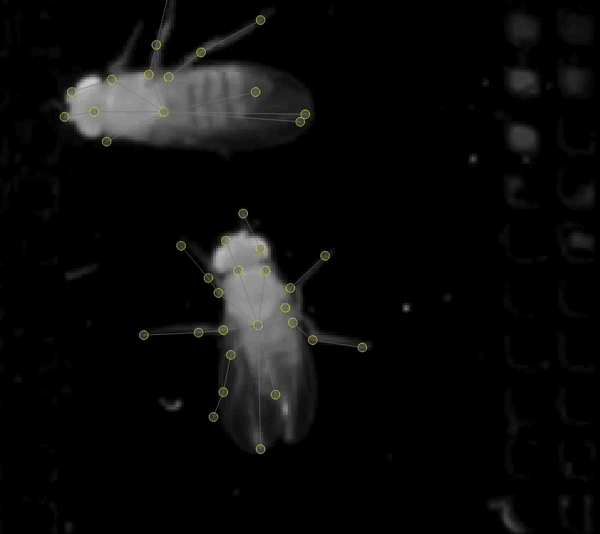

# Prediction-Assisted Labeling

Prediction-assisted labeling accelerates your workflow by using model predictions to bootstrap new labels.

**Benefits:**

- **Faster labeling** — Correcting a mostly-correct prediction is quicker than labeling from scratch
- **Targeted feedback** — See where your model succeeds and fails, helping you choose the most useful frames to label

---

## The Active Learning Loop

```
┌─────────────────────────────────────────────────────────┐
│                                                         │
│   Label frames  →  Train model  →  Predict  →  Correct  │
│        ↑                                          │     │
│        └──────────────────────────────────────────┘     │
│                                                         │
└─────────────────────────────────────────────────────────┘
```

1. **Label** a small set of frames manually
2. **Train** a model on your labels
3. **Predict** on suggested or unlabeled frames
4. **Correct** the predictions to create new training data
5. **Repeat** until accuracy is satisfactory

---

## Understanding the Seekbar

After running inference, the seekbar shows different markers:

| Marker | Meaning |
|--------|---------|
| **Thick black line** | Manually labeled frame |
| **Thin black line** | Frame with predictions |
| **Dark blue line** | Suggested frame with manual labels |
| **Light blue line** | Suggested frame with predictions |
| **Red marker** | Suggested frame ready for review |

---

## Correcting Predictions

Predicted instances appear in **grey with yellow nodes**. To edit them:

1. **Double-click** the predicted instance to convert it to an editable instance
2. Adjust the nodes as needed
3. Save your changes



!!! tip "Visual feedback"
    After converting a prediction:

    - **Red nodes** = unchanged from prediction
    - **Green nodes** = manually adjusted

    This helps you track which nodes you've reviewed.

!!! warning "Predictions don't train automatically"
    Predicted instances are **not** used for training until you convert and correct them. Always double-click to convert before making edits.

---

## Best Practices

1. **Generate new suggestions regularly** — Active learning works best with fresh suggestions based on your latest model

2. **Focus on failure cases** — Prioritize frames where predictions are wrong or uncertain

3. **Don't over-correct** — If a prediction is close enough, a small adjustment is fine

4. **Iterate frequently** — Several rounds of train → predict → correct typically yields better results than one large labeling session

---

## Next Steps

Once you have accurate frame-by-frame predictions, you're ready to:

- **Run inference on full videos** — Predict poses across entire clips
- **Track identities** — Link instances across frames (see [Tracking methods](../guides/tracking-and-proofreading.md#tracking-methods))
- **Proofread tracks** — Use the proofreading tools to fix tracking errors

