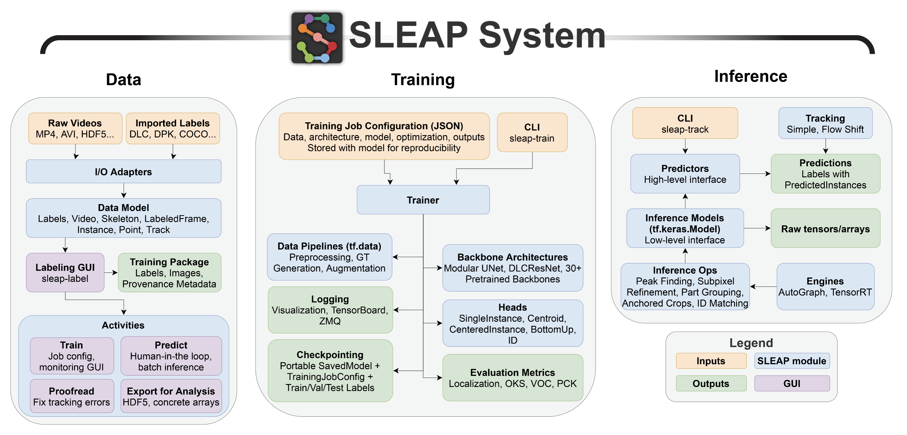

# SLEAP System Overview

SLEAP is built as three interconnected packages that work together to provide a complete pose estimation workflow.

---

## Package Architecture

```
┌─────────────────────────────────────────────────────────────────┐
│                           sleap                                  │
│         GUI, CLI entry points, quality control, glue            │
├─────────────────────────────────────────────────────────────────┤
│                              │                                   │
│              ┌───────────────┴───────────────┐                  │
│              ▼                               ▼                   │
│     ┌─────────────────┐            ┌─────────────────┐          │
│     │    sleap-io     │            │    sleap-nn     │          │
│     │                 │            │                 │          │
│     │  Data model     │            │  PyTorch models │          │
│     │  File I/O       │◄──────────►│  Training       │          │
│     │  Format convert │            │  Inference      │          │
│     │  Video backends │            │  Tracking       │          │
│     └─────────────────┘            └─────────────────┘          │
└─────────────────────────────────────────────────────────────────┘
```

### sleap

The main package providing:

- **Labeling GUI** (`sleap label`) — Annotate keypoints, manage projects, review predictions
- **Unified CLI** (`sleap`) — Single entry point for all commands
- **Quality Control** — Detect annotation errors
- **Integration layer** — Connects sleap-io and sleap-nn

### sleap-io

Data handling and I/O operations:

- **Data model** — Labels, Videos, Skeletons, Instances, Tracks
- **File formats** — Native `.slp`, plus import/export for COCO, NWB, DeepLabCut, and more
- **Video backends** — Read frames from MP4, AVI, HDF5, image sequences
- **Utilities** — Merging, rendering, transformations

Documentation: [io.sleap.ai](https://io.sleap.ai)

### sleap-nn

Neural network backend (PyTorch):

- **Model architectures** — Top-down, bottom-up, single-instance, centered-instance
- **Backbone networks** — UNet, ConvNeXt, SwinT, and pretrained options
- **Training** — Data augmentation, loss functions, optimization, logging (WandB, TensorBoard)
- **Inference** — Pose prediction, peak finding, multi-instance grouping
- **Tracking** — Identity tracking across frames

Documentation: [nn.sleap.ai](https://nn.sleap.ai)

---

## Workflow Stages

### 1. Data Preparation

| Step | Tool | Description |
|------|------|-------------|
| Import videos | GUI or `sleap-io` | Load MP4, AVI, HDF5, or image sequences |
| Create skeleton | GUI | Define nodes and edges for your animal |
| Label frames | GUI | Annotate keypoints on training frames |
| Import existing labels | GUI or `sleap-io` | Convert from COCO, DLC, LEAP formats |

### 2. Training

| Step | Tool | Description |
|------|------|-------------|
| Configure model | GUI or config file | Choose model type, backbone, hyperparameters |
| Train | GUI or `sleap nn-train` | Train on labeled data with augmentation |
| Monitor | TensorBoard or WandB | Track loss, metrics, visualizations |
| Evaluate | GUI | Check precision, recall on validation data |

### 3. Inference

| Step | Tool | Description |
|------|------|-------------|
| Run inference | GUI or `sleap nn-track` | Predict poses on new videos |
| Track identities | Automatic | Link instances across frames |
| Proofread | GUI | Fix tracking errors |
| Export | GUI or `sleap convert` | Save to HDF5, CSV, NWB, COCO, etc. |

---

## CLI Commands

The unified `sleap` CLI provides access to all functionality:

```bash
sleap label [FILE]      # Launch GUI
sleap doctor            # Check installation
sleap nn-train ...      # Train models (sleap-nn)
sleap nn-track ...      # Run inference (sleap-nn)
sleap convert ...       # Convert formats (sleap-io)
sleap show ...          # Inspect files (sleap-io)
```

See [Command Line Interfaces](../reference/command-line-interfaces.md) for full documentation.

---

## Legacy Architecture

!!! note "Historical context"
    Earlier versions of SLEAP (pre-1.5) used TensorFlow for training and inference. The diagram below shows this legacy architecture for reference. Current versions use **sleap-nn** (PyTorch-based) for all neural network operations.


